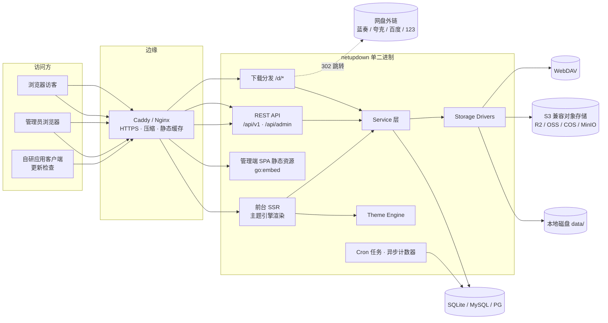
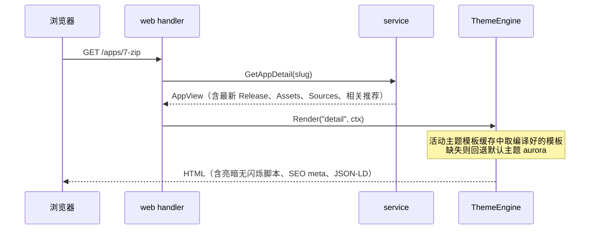
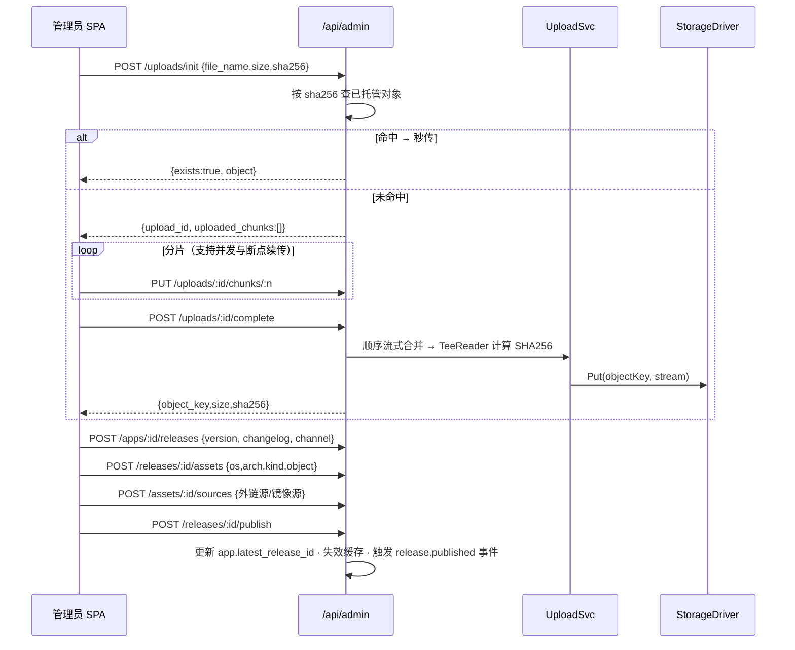

# 03 · 系统架构设计

> 状态：设计定稿 · 2026-08-27

## 1. 总体架构

NetUpDown 是**单进程单二进制**应用：同一进程内提供前台 SSR 页面、REST API、管理端静态资源、下载分发与后台任务。水平扩展不是设计目标（个人站点），但所有状态都在 DB 与存储中，未来仍可多副本 + 外部 DB。



## 2. 代码目录结构

```text
netupdown/
├── cmd/netupdown/main.go        # 入口：cobra 子命令 serve / admin / version
├── internal/
│   ├── bootstrap/               # 组装根：加载配置→日志→DB→迁移→依赖注入→路由→HTTP Server→优雅退出
│   ├── config/                  # 启动配置结构体与加载（yaml + env 覆盖）
│   ├── model/                   # GORM 模型 + 枚举常量（状态机、类型定义）
│   ├── repo/                    # 数据访问层：查询封装、事务助手；只被 service 调用
│   ├── service/                 # 业务逻辑层（按域拆分）
│   │   ├── appsvc/              #   应用/分类/标签
│   │   ├── releasesvc/          #   版本/文件/下载源、发布状态机、更新检查
│   │   ├── downloadsvc/         #   下载源选择、计数、日志
│   │   ├── uploadsvc/           #   分片上传会话、合并、秒传
│   │   ├── storagesvc/          #   存储实例管理、驱动工厂、连通测试
│   │   ├── themesvc/            #   主题安装/切换/配置
│   │   ├── settingsvc/          #   运行时设置（缓存读 + 落库写）
│   │   ├── statsvc/             #   统计查询与聚合
│   │   ├── authsvc/             #   登录、令牌、会话
│   │   └── pagesvc/             #   自定义单页/友链
│   ├── storage/                 # 存储驱动接口 + local / s3 / webdav 实现（不依赖 service）
│   ├── theme/                   # 主题引擎：包扫描、theme.json 解析、模板编译缓存、渲染、回退
│   ├── web/                     # 前台 handler：SSR 页面、/d 下载、feed/sitemap/robots
│   ├── api/
│   │   ├── v1/                  # 公开 API handler
│   │   └── admin/               # 管理 API handler
│   ├── middleware/              # JWT 认证、限流、访问日志、Recovery、安全响应头、真实 IP
│   ├── task/                    # cron 注册、异步计数器 flush、清理任务
│   ├── pkg/                     # 无业务小工具：apperr、resp（统一响应）、pagination、cryptoutil、
│   │                            #   semverutil、imgutil、slugify、httprange
│   └── assets/                  # go:embed 资源：默认主题、admin 构建产物、robots 模板等
├── web/
│   ├── admin/                   # Vue 管理端源码（dist 由 Makefile 复制到 internal/assets/admin）
│   └── themes/aurora/           # 默认主题源码（tailwind 源文件 + 编译产物均入库）
├── docs/                        # 本文档
├── scripts/                     # build.ps1 / backup.sh 等
├── config.example.yaml
├── Dockerfile · docker-compose.yml · Makefile · .golangci.yml · .air.toml
└── go.mod
```

### 分层与依赖方向（强制）

```text
web / api  ──→  service  ──→  repo  ──→  model
                  │
                  ├──→ storage（驱动接口）
                  └──→ theme（渲染引擎，仅 web 侧经 service 间接使用）
```

- handler 不写 SQL、不碰 GORM；repo 不含业务规则；`storage`/`theme`/`pkg` 不得 import `service`；
- 跨域调用只走 service 之间的接口，禁止 handler 跨层直捅 repo。

## 3. 路由总表

### 3.1 前台（SSR，主题渲染）

| 路径 | 页面 | 说明 |
|---|---|---|
| `GET /` | 首页 | F-101 |
| `GET /apps` | 应用列表 | 查询参数 `page` `category` `platform` `type` `sort` `q` |
| `GET /apps/:slug` | 应用详情 | 含最新版本文件与下载源 |
| `GET /apps/:slug/releases` | 历史版本 | P1 |
| `GET /categories/:slug` | 分类页 | 等价于带分类筛选的列表 |
| `GET /tags/:slug` | 标签页 | P1 |
| `GET /search?q=` | 搜索结果页 | |
| `GET /pages/:slug` | 自定义单页 | P1 |
| `GET /d/:assetID` | 下载分发 | 见 06 册；有提取码外链时渲染落地页 |
| `GET /feed.xml` | RSS | P1 |
| `GET /sitemap.xml` `GET /robots.txt` | SEO | P1 |
| `GET /healthz` | 健康检查 | 返回 `{status, version}` |

### 3.2 静态资源

| 路径 | 来源 | 缓存策略 |
|---|---|---|
| `GET /themes/:themeID/static/*` | 主题包 static 目录（用户目录优先，内嵌兜底） | `Cache-Control: public, max-age=604800` + ETag；模板中 `asset()` 带 `?v=主题版本` |
| `GET /uploads/*` | `data/uploads/`（图标、截图等公开图片） | 同上 |
| `GET /admin/*` | go:embed 的 SPA 产物 | index.html 不缓存，带 hash 的资源长缓存；未匹配路径回退 index.html（history 模式） |

> 注意：本地存储驱动的软件文件目录 `data/files/` **绝不**静态暴露，只能经 `/d/*` 分发。

### 3.3 API

| 前缀 | 认证 | 说明 |
|---|---|---|
| `/api/v1/*` | 无 | 公开只读 API（列表/详情/更新检查），限流 60 req/min/IP |
| `/api/admin/*` | JWT Bearer | 管理 API；登录/刷新端点例外并单独强限流 |

完整接口清单见 [05-api.md](05-api.md)。

## 4. 配置体系（三层）

| 层 | 载体 | 生效时机 | 内容 |
|---|---|---|---|
| 启动配置 | `config.yaml` | 进程启动 | 监听地址、base_url、DB、数据目录、日志、上传限制、密钥来源 |
| 环境变量 | `NETUPDOWN_` 前缀 | 进程启动，覆盖同名文件配置 | 如 `NETUPDOWN_SERVER__ADDR=:9000`（`__` 表层级）、`NETUPDOWN_MASTER_KEY` |
| 运行时设置 | DB `settings` 表 | 即时（写后失效缓存） | 站点信息、SEO、主题、下载策略、注入代码…（全表见 08 册） |

划分原则：**改了必须重启的进配置文件；后台界面可改的进 settings 表**。`base_url` 属启动配置（涉及回调与绝对链接生成，避免后台误改打挂站点）。

## 5. 关键流程

### 5.1 前台页面渲染



### 5.2 发布一个版本（管理端）



### 5.3 下载分发

见 [06-storage.md](06-storage.md) 的决策流程图；核心原则：**先异步计数，再按源类型选最廉价的分发方式**（302 优先于代理）。

## 6. 缓存策略（进程内内存缓存）

| 缓存对象 | 键 | 失效方式 |
|---|---|---|
| settings 全量 | 单例 map | 任意设置写入后整体重载 |
| 活动主题编译模板 | themeID | 切换主题/上传主题时重建；`theme.dev=true` 时每请求重载 |
| 分类列表 / 热门标签 | 固定键 | 写操作事件失效 + 5 分钟 TTL 兜底 |
| 首页数据（精选/最新） | 固定键 | `release.published` / `app.updated` 事件失效 + 60s TTL |
| 浏览量去重 | LRU（ip+appID → 时间） | 30 分钟窗口 |
| 下载计数去重 | LRU（ip+assetID → 时间） | `download.dedup_window_min` 设置，默认 10 分钟 |

实现：`internal/pkg` 内一个泛型 TTL+LRU 小缓存（几十行），不引重型缓存库；事件用进程内简单 observer（`internal/task/events.go`）。

## 7. 异步与定时任务

### 异步计数器

下载/浏览计数不阻塞请求：写入带缓冲 channel（容量 4096，满则丢弃计数并记 warn 日志），后台 goroutine 每 5 秒或每 200 条批量 `UPDATE ... SET download_count = download_count + n` 并批插 `download_logs`。进程退出前 flush。

### Cron 任务（robfig/cron，随进程启动）

| 时间 | 任务 |
|---|---|
| 每日 01:00 | 聚合昨日 `download_logs` → `stat_daily`（应用维度 + 全站维度） |
| 每日 02:00 | 清理超过 `download.log_retention_days`（默认 90 天）的 `download_logs` |
| 每小时 | 清理超时（>24h）未完成的分片上传临时目录 `data/tmp/uploads/*` |
| 每日 03:00（P2） | 外链有效性巡检（F-407） |

## 8. 错误处理与日志约定

- service 层返回 `apperr.Error{Code, HTTPStatus, Msg, cause}`；handler 统一经 `resp.Fail(c, err)` 输出 envelope（见 05 册），未知错误一律 500 + code 10000，不泄漏内部信息；
- 所有 error 向上传播必须 `fmt.Errorf("...: %w", err)` 包装；
- slog 结构化字段约定：`req_id`（中间件生成，响应头 `X-Request-Id` 回显）、`ip`、`path`、`latency_ms`、`uid`；
- 访问日志 info 级；慢请求（>1s）warn；panic 由 Recovery 中间件捕获记 error 并 500。

## 9. 优雅启动与退出

启动顺序：配置 → 日志 → DB 连接（SQLite 设 WAL、busy_timeout=5000、foreign_keys=on）→ AutoMigrate → 种子数据 → settings 缓存预热 → 主题引擎加载 → 存储驱动池初始化 → cron 启动 → HTTP 监听。

退出（SIGINT/SIGTERM）：停止接收新请求 → `http.Server.Shutdown`（30s 宽限）→ flush 异步计数器 → 停 cron → 关 DB。
