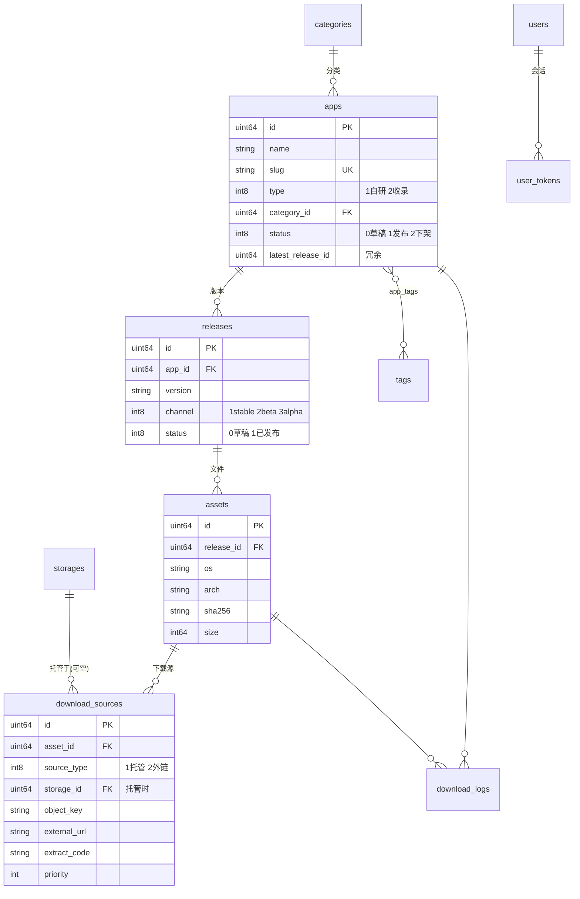

# 04 · 数据库设计

> 状态：设计定稿 · 2026-08-27

## 1. 设计约定

- 默认 SQLite（WAL 模式）；兼容 MySQL 8+（utf8mb4/InnoDB）与 PostgreSQL 14+，字段类型按 GORM 方言映射；
- 主键：`id` 无符号自增 BIGINT（GORM `uint64`）；
- 时间：`created_at` / `updated_at` 由 GORM 维护，**UTC** 存储，精度毫秒；
- 软删除：内容类表（apps、releases、pages）带 `deleted_at`（GORM `gorm.DeletedAt`）；其余硬删；
- 布尔：`bool`（SQLite 存 0/1）；
- 枚举：Go 侧定义 `int8` 常量 + `String()`，库内存整数；
- JSON 字段：Go 侧 `[]string` / 结构体 + `gorm:"serializer:json"`，库内 TEXT；
- 命名：表名复数蛇形（GORM 默认），外键 `xxx_id`；
- 计数冗余：`download_count` 等冗余列由异步计数器累加，聚合表负责按日趋势，两者用途不同不互替。

## 2. ER 图



## 3. 表结构定义

### 3.1 users — 用户

| 字段 | 类型 | 约束/默认 | 说明 |
|---|---|---|---|
| id | BIGINT UN | PK AI | |
| username | VARCHAR(50) | UK, NOT NULL | 登录名，小写字母数字下划线 |
| password_hash | VARCHAR(255) | NOT NULL | argon2id 编码串 |
| email | VARCHAR(120) | UK, NULL | 可选 |
| nickname | VARCHAR(50) | | 显示名 |
| avatar | VARCHAR(255) | | `/uploads/...` |
| role | TINYINT | NOT NULL, 默认 2 | 1=admin 2=user |
| status | TINYINT | NOT NULL, 默认 1 | 1=正常 2=禁用 |
| totp_secret | VARCHAR(255) | NULL | AES-GCM 加密，P2 |
| last_login_at | DATETIME | NULL | |
| last_login_ip | VARCHAR(45) | | |
| created_at / updated_at | DATETIME | | |

### 3.2 user_tokens — 刷新令牌会话

| 字段 | 类型 | 说明 |
|---|---|---|
| id | BIGINT UN PK | |
| user_id | BIGINT UN, INDEX | |
| token_hash | CHAR(64), UK | 刷新令牌的 SHA256（原文不落库） |
| ua | VARCHAR(300) | 登录设备 UA |
| ip | VARCHAR(45) | |
| expires_at | DATETIME, INDEX | 默认签发后 30 天 |
| revoked_at | DATETIME NULL | 注销/被顶下线时间 |
| created_at | DATETIME | |

> 刷新令牌轮换：每次使用即作废旧行、签发新行（详见 09 册）。支持"注销全部设备"= 按 user_id 批量 revoke。

### 3.3 categories — 分类

| 字段 | 类型 | 说明 |
|---|---|---|
| id | BIGINT UN PK | |
| name | VARCHAR(50) NOT NULL | 如「效率工具」 |
| slug | VARCHAR(50) UK | 如 `productivity` |
| icon | VARCHAR(100) | 图标名或图片 URL |
| description | VARCHAR(255) | |
| sort | INT 默认 0 | 越小越靠前 |
| created_at / updated_at | | |

> v1 单级分类；`parent_id` 留待 P2 需要时加列。

### 3.4 tags / app_tags — 标签

`tags`: `id`, `name VARCHAR(30) UK`, `slug VARCHAR(30) UK`, `created_at`。
`app_tags`: 复合主键 (`app_id`, `tag_id`)，两列各建索引。

### 3.5 apps — 应用（核心表）

| 字段 | 类型 | 约束/默认 | 说明 |
|---|---|---|---|
| id | BIGINT UN | PK AI | |
| name | VARCHAR(100) | NOT NULL | 显示名 |
| slug | VARCHAR(100) | UK NOT NULL | URL 标识，`[a-z0-9-]{2,80}`；英文名自动生成，中文名需手填 |
| type | TINYINT | NOT NULL 默认 1, INDEX | 1=自研 self 2=收录 third |
| category_id | BIGINT UN | INDEX, NULL | |
| tagline | VARCHAR(200) | | 一句话简介（列表卡片用） |
| description | TEXT | | Markdown 详细介绍 |
| icon | VARCHAR(255) | | 建议 512×512 |
| screenshots | TEXT(JSON) | | `["/uploads/...","..."]` |
| official_url | VARCHAR(255) | | 官网 |
| repo_url | VARCHAR(255) | | 源码仓库 |
| developer | VARCHAR(100) | | 开发者/厂商（收录类展示） |
| license | VARCHAR(50) | | 如 MIT / 免费 / 共享软件 |
| platforms | TEXT(JSON) | | `["windows","macos","linux","android","ios","web"]` 子集 |
| status | TINYINT | NOT NULL 默认 0 | 0=草稿 1=已发布 2=已下架 |
| is_featured | BOOL 默认 false | | 首页精选 |
| is_pinned | BOOL 默认 false | | 列表置顶 |
| sort_weight | INT 默认 0 | | 人工排序权重 |
| latest_release_id | BIGINT UN NULL | | 冗余，最新已发布 stable 版本 |
| download_count | BIGINT 默认 0 | | 冗余累计 |
| view_count | BIGINT 默认 0 | | 冗余累计 |
| seo_title / seo_description / seo_keywords | VARCHAR(200/300/200) | | 留空则自动生成 |
| published_at | DATETIME NULL | INDEX | 首次发布时间 |
| created_at / updated_at / deleted_at | | | 软删 |

索引：`(status, published_at DESC)`（列表页主查询）、`category_id`、`type`、`slug` 唯一。

### 3.6 releases — 版本

| 字段 | 类型 | 约束/默认 | 说明 |
|---|---|---|---|
| id | BIGINT UN | PK | |
| app_id | BIGINT UN | INDEX NOT NULL | |
| version | VARCHAR(50) | NOT NULL | 展示版本号，建议 semver（可带 `v` 前缀，入库去前缀） |
| version_code | INT NULL | | 数值版本（Android 或非 semver 兜底比较） |
| channel | TINYINT | NOT NULL 默认 1 | 1=stable 2=beta 3=alpha |
| title | VARCHAR(200) | | 可选发布标题 |
| changelog | TEXT | | Markdown 更新日志 |
| min_required_version | VARCHAR(50) NULL | | 低于此版本的客户端标记强制更新 |
| status | TINYINT 默认 0 | | 0=草稿 1=已发布 |
| download_count | BIGINT 默认 0 | | |
| published_at | DATETIME NULL | | |
| created_at / updated_at / deleted_at | | | |

约束：`UNIQUE(app_id, version, channel)`（同渠道不允许重复版本号）。

### 3.7 assets — 版本文件

| 字段 | 类型 | 说明 |
|---|---|---|
| id | BIGINT UN PK | |
| release_id | BIGINT UN, INDEX NOT NULL | |
| name | VARCHAR(200) | 显示名，如「Windows 64 位 安装版」 |
| file_name | VARCHAR(255) | 下载落地文件名，如 `MyApp-1.4.1-win-x64-setup.exe` |
| os | VARCHAR(20) | `windows/macos/linux/android/ios/any` |
| arch | VARCHAR(20) | `amd64/arm64/universal/any` |
| kind | TINYINT | 1=安装包 2=便携版 3=压缩包 4=补丁 9=其他 |
| size | BIGINT | 字节；托管源上传时自动写入，外链-only 时手填 |
| sha256 | CHAR(64), INDEX | 托管上传自动计算；外链可手填或留空 |
| download_count | BIGINT 默认 0 | |
| sort | INT 默认 0 | |
| created_at / updated_at | | |

> `sha256` 建索引用于秒传查询（F-305）与 VirusTotal 链接生成。

### 3.8 download_sources — 下载源

| 字段 | 类型 | 说明 |
|---|---|---|
| id | BIGINT UN PK | |
| asset_id | BIGINT UN, INDEX NOT NULL | |
| name | VARCHAR(100) | 展示名：「直链下载」「蓝奏云」「百度网盘」 |
| source_type | TINYINT NOT NULL | 1=managed 托管 2=external 外链 |
| storage_id | BIGINT UN NULL | 托管时指向 storages |
| object_key | VARCHAR(500) | 托管时的对象键 |
| external_url | VARCHAR(1000) | 外链 URL |
| extract_code | VARCHAR(50) | 提取码，可空 |
| priority | INT 默认 0 | 越小越优先；最小者为默认源 |
| is_enabled | BOOL 默认 true | |
| download_count | BIGINT 默认 0 | |
| last_check_at / last_check_ok | DATETIME NULL / BOOL NULL | P2 外链巡检结果 |
| created_at / updated_at | | |

不变式（service 层保证）：`source_type=1` ⇒ `storage_id`、`object_key` 非空；`source_type=2` ⇒ `external_url` 非空。删除托管源时联动删除存储对象（可选保留，删除时询问）。

### 3.9 storages — 存储实例

| 字段 | 类型 | 说明 |
|---|---|---|
| id | BIGINT UN PK | |
| name | VARCHAR(50) | 如「Cloudflare R2 主桶」 |
| driver | VARCHAR(20) NOT NULL | `local` / `s3` / `webdav` |
| config | TEXT NOT NULL | 驱动配置 JSON，**AES-256-GCM 加密存储**（见 06/09 册） |
| is_default | BOOL 默认 false | 全局唯一默认（service 层保证） |
| is_enabled | BOOL 默认 true | 停用后其下源在前台隐藏 |
| remark | VARCHAR(255) | |
| created_at / updated_at | | |

### 3.10 settings — 运行时设置

| 字段 | 类型 | 说明 |
|---|---|---|
| key | VARCHAR(100) PK | 如 `site.title`、`theme.active` |
| value | TEXT | 字符串/JSON |
| updated_at | DATETIME | |

全部键清单与默认值见 [08-admin.md](08-admin.md) §5。

### 3.11 pages — 自定义单页（P1）

`id`, `title VARCHAR(200)`, `slug VARCHAR(100) UK`, `content TEXT(Markdown)`, `status TINYINT(0草稿/1发布)`, `sort INT`, `seo_description VARCHAR(300)`, `created_at/updated_at/deleted_at`。

### 3.12 friend_links — 友情链接（P2）

`id`, `name`, `url`, `logo`, `description`, `sort`, `is_enabled`, `created_at`。

### 3.13 download_logs — 下载明细

| 字段 | 类型 | 说明 |
|---|---|---|
| id | BIGINT UN PK | |
| app_id / release_id / asset_id / source_id | BIGINT UN | 均建普通索引（app_id、asset_id） |
| ip | VARCHAR(64) | 按 `privacy.ip_mode` 存明文 / 截断（IPv4 /24、IPv6 /48）/ SHA256 |
| ua | VARCHAR(300) | 截断存储 |
| referer | VARCHAR(300) | 截断存储 |
| created_at | DATETIME, INDEX | 清理任务按此删除 |

### 3.14 stat_daily — 每日聚合

| 字段 | 类型 | 说明 |
|---|---|---|
| id | BIGINT UN PK | |
| date | DATE NOT NULL | |
| app_id | BIGINT UN NOT NULL | 0 表示全站行 |
| downloads | INT 默认 0 | |
| views | INT 默认 0 | |

约束：`UNIQUE(date, app_id)`。浏览量当日实时累加（异步计数器直接 upsert 当日行），下载量次日由聚合任务从 download_logs 校正回填。

### 3.15 operation_logs — 操作审计

`id`, `user_id`, `action VARCHAR(50)`（如 `app.create` `release.publish` `storage.update` `setting.update` `auth.login`）, `target_type VARCHAR(30)`, `target_id BIGINT`, `detail TEXT(JSON，脱敏后的关键字段)`, `ip VARCHAR(45)`, `created_at(INDEX)`。

### 3.16 comments — 评论（P2，随功能开启建表）

`id`, `app_id(INDEX)`, `user_id NULL`, `guest_name/guest_email/guest_site`, `content TEXT`, `status TINYINT(0待审/1通过/2垃圾)`, `parent_id/reply_to_id`, `ip`, `ua`, `created_at`。

## 4. GORM 模型示例

```go
// internal/model/app.go
type App struct {
    ID              uint64         `gorm:"primaryKey"`
    Name            string         `gorm:"size:100;not null"`
    Slug            string         `gorm:"size:100;uniqueIndex;not null"`
    Type            AppType        `gorm:"type:tinyint;not null;default:1;index"`
    CategoryID      *uint64        `gorm:"index"`
    Category        *Category
    Tagline         string         `gorm:"size:200"`
    Description     string         `gorm:"type:text"`
    Icon            string         `gorm:"size:255"`
    Screenshots     []string       `gorm:"type:text;serializer:json"`
    OfficialURL     string         `gorm:"size:255"`
    RepoURL         string         `gorm:"size:255"`
    Developer       string         `gorm:"size:100"`
    License         string         `gorm:"size:50"`
    Platforms       []string       `gorm:"type:text;serializer:json"`
    Status          PublishStatus  `gorm:"type:tinyint;not null;default:0;index:idx_apps_pub,priority:1"`
    IsFeatured      bool
    IsPinned        bool
    SortWeight      int
    LatestReleaseID *uint64
    DownloadCount   int64
    ViewCount       int64
    SeoTitle        string         `gorm:"size:200"`
    SeoDescription  string         `gorm:"size:300"`
    SeoKeywords     string         `gorm:"size:200"`
    PublishedAt     *time.Time     `gorm:"index:idx_apps_pub,priority:2,sort:desc"`
    Tags            []Tag          `gorm:"many2many:app_tags"`
    CreatedAt       time.Time
    UpdatedAt       time.Time
    DeletedAt       gorm.DeletedAt `gorm:"index"`
}

type DownloadSource struct {
    ID           uint64     `gorm:"primaryKey"`
    AssetID      uint64     `gorm:"index;not null"`
    Name         string     `gorm:"size:100"`
    SourceType   SourceType `gorm:"type:tinyint;not null"` // 1 managed, 2 external
    StorageID    *uint64
    ObjectKey    string     `gorm:"size:500"`
    ExternalURL  string     `gorm:"size:1000"`
    ExtractCode  string     `gorm:"size:50"`
    Priority     int
    IsEnabled    bool       `gorm:"default:true"`
    DownloadCount int64
    CreatedAt    time.Time
    UpdatedAt    time.Time
}
```

## 5. 迁移与种子数据

### 迁移策略

- v1 使用 **GORM AutoMigrate**（启动时执行，只增列/索引不删列），配合每个 release 的升级说明；破坏性变更（改列名/拆表）写一次性迁移函数登记在 `internal/bootstrap/migrate.go` 的版本化列表中，用 `settings` 键 `sys.schema_version` 记录已执行到的版本号；
- SQLite 连接初始化 PRAGMA：`journal_mode=WAL`、`busy_timeout=5000`、`foreign_keys=ON`、`synchronous=NORMAL`。

### 种子数据（首次启动且表空时写入）

1. 默认分类：「效率工具」「开发编程」「影音图像」「系统增强」「网络工具」「我的作品」；
2. `settings` 全部默认键值（见 08 册 §5）；
3. 默认本地存储实例：`name=本地存储, driver=local, config={"root":"files"}, is_default=true`；
4. 管理员账号**不**自动创建：由 `netupdown admin create` CLI 或安装向导（P1）创建，避免默认口令风险。

## 6. 典型查询与性能预案

| 场景 | 查询 | 预案 |
|---|---|---|
| 列表页 | `status=1` 按 `is_pinned DESC, published_at DESC` 分页，JOIN category，预载 latest_release | 复合索引 `(status, published_at)`；分页用 LIMIT/OFFSET（数据量 <1 万无需游标） |
| 详情页 | slug 查 app + 最新 release 的 assets + sources | slug 唯一索引；一次预加载三层（GORM Preload） |
| 搜索 | `name/tagline LIKE %q%` 或命中 tag | 数据量小 LIKE 足够；P2 切 FTS5/bleve（见 11 册） |
| 更新检查 | app slug → 指定渠道最新 release → 按 os/arch 匹配 asset | 高频接口：结果按 (slug,channel) 内存缓存，发布事件失效 |
| 聚合 | 按日 GROUP BY download_logs | 夜间任务执行，加 `created_at` 索引 |
