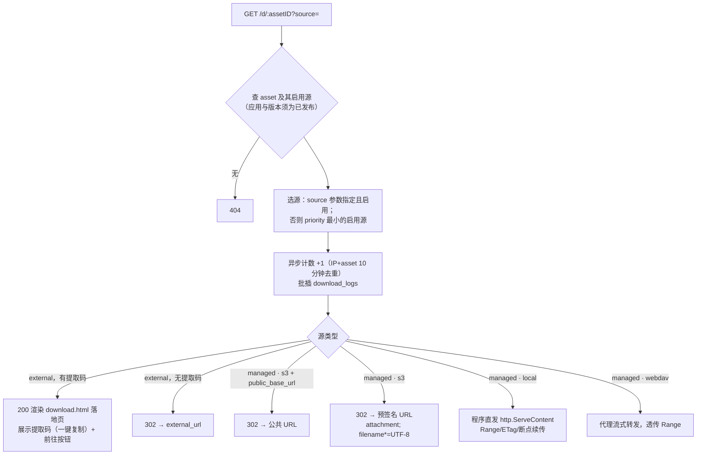

# 06 · 存储系统设计

> 状态：设计定稿 · 2026-08-27

## 1. 概念模型

```text
Storage（存储实例，DB 配置） ──使用──▶ Driver（驱动实现：local / s3 / webdav）
DownloadSource（下载源）
 ├─ managed 托管源：storage_id + object_key，文件实体在我方存储
 └─ external 外链源：external_url (+ extract_code)，仅记录跳转信息
Asset（文件）1 ──▶ N DownloadSource（访客可选源；priority 最小的启用源为默认）
```

设计要点：

- **托管与外链统一到 DownloadSource**：详情页与下载入口不需要区分对待"上传的文件"与"网盘链接"，同一个 asset 可同时有直链与多个网盘源；
- **一份实体多处引用**：同一 (storage_id, object_key) 可被多个源引用（理论上），删除托管源连删对象前需检查引用计数；
- **驱动无业务**：`internal/storage` 只做字节的存取删签名，不 import service/model。

## 2. 驱动接口

```go
// internal/storage/driver.go
package storage

var ErrPresignUnsupported = errors.New("storage: presign unsupported")

type ObjectInfo struct {
    Key     string
    Size    int64
    ModTime time.Time
}

type OpenOptions struct {
    Offset int64 // Range 起点；0 表示从头
    Length int64 // <=0 表示直到末尾
}

type Driver interface {
    Kind() string // "local" | "s3" | "webdav"

    // Put 原子写入：先写临时对象再提交（本地=tmp+rename；S3=SDK 分片上传）。
    // r 必须恰好读出 size 字节，多退少补都算失败。
    Put(ctx context.Context, key string, r io.Reader, size int64) error

    // Open 读取对象（支持 Range，用于代理下载与断点续传）。
    Open(ctx context.Context, key string, opt *OpenOptions) (io.ReadCloser, error)

    Stat(ctx context.Context, key string) (*ObjectInfo, error)
    Delete(ctx context.Context, key string) error

    // PresignURL 生成限时下载直链（含 Content-Disposition 文件名）。
    // 不支持的驱动返回 ErrPresignUnsupported，调用方回退为代理/直发。
    PresignURL(ctx context.Context, key, filename string, expire time.Duration) (string, error)
}
```

驱动能力矩阵：

| 能力 | local | s3 | webdav (P2) |
|---|---|---|---|
| Range 读取 | ✅（`os.File` Seek） | ✅（GetObject Range 头） | ✅（Range 头，视服务端） |
| 预签名直链 | ❌（程序直发） | ✅（Presign GetObject） | ❌（代理转发） |
| 分发方式 | `http.ServeContent`（ETag/Range/断点续传全兜住） | 302 → 预签名 URL | 程序代理流式转发 |
| 原子写 | tmp 文件 + `os.Rename` | SDK Multipart Upload | 上传临时名 + MOVE |

驱动实例由 `storagesvc` 的工厂按 storages 表构建并按 id 池化缓存；配置变更时重建。

## 3. 各驱动配置 schema（storages.config，加密存储）

### 3.1 local

```json
{ "root": "files" }
```

- `root` 为相对 `data/` 的目录（默认 `files`，即 `data/files/`）；也允许绝对路径（挂载盘）；
- **路径安全**：所有 key 经 `secureJoin(root, key)` —— `filepath.Clean` 后校验仍在 root 内，含 `..`、盘符、UNC 一律拒绝；
- 该目录不进静态路由，只能经 `/d/*` 访问。

### 3.2 s3（兼容全家桶）

```json
{
  "endpoint": "https://<accountid>.r2.cloudflarestorage.com",
  "region": "auto",
  "bucket": "netupdown",
  "access_key_id": "…",
  "secret_access_key": "…",          // 加密存储；API 回显为 ******
  "base_path": "files/",              // 桶内前缀，可空
  "force_path_style": false,          // MinIO/自建需 true
  "public_base_url": "",              // 可选：桶已公开/接了 CDN 时填，如 https://dl.netupdown.com
  "presign_expire_minutes": 30
}
```

分发策略：`public_base_url` 非空 → 302 到 `public_base_url + "/" + key`（适合 R2 + 自定义域 + CDN）；否则 → 预签名 302。

常见服务参数速查：

| 服务 | endpoint | region | path style |
|---|---|---|---|
| Cloudflare R2 | `https://<account>.r2.cloudflarestorage.com` | `auto` | false |
| 阿里云 OSS | `https://oss-cn-hangzhou.aliyuncs.com` | `oss-cn-hangzhou` | false |
| 腾讯云 COS | `https://cos.ap-guangzhou.myqcloud.com` | `ap-guangzhou` | false |
| MinIO | `http(s)://minio.internal:9000` | `us-east-1` | true |
| Backblaze B2 | `https://s3.us-west-004.backblazeb2.com` | `us-west-004` | false |

### 3.3 webdav（P2）

```json
{ "url": "https://dav.jianguoyun.com/dav/", "username": "…", "password": "…", "base_path": "netupdown/" }
```

### 3.4 外链源（非驱动）

不占 storages 表；直接存于 download_sources：`external_url`（http/https 校验）、`extract_code`。适配一切网盘：蓝奏云、夸克、百度网盘、123 云盘、OneDrive 分享等。

## 4. 上传链路

### 4.1 对象键（object_key）规则

```text
{app_slug}/{version}/{file_name}
例：myapp/1.4.1/MyApp-1.4.1-win-x64-setup.exe
```

- complete 时由 `key_hint`（`{app_slug}/{version}`）+ 净化后的 file_name 拼出；键已存在则追加 `-1`、`-2`；
- file_name 净化：去路径分隔符与控制字符，保留中文；长度 ≤ 200。

### 4.2 分片上传协议（F-305）

- 分片大小：默认 5 MiB（`upload.chunk_size_mb`），最后一片可短；
- 临时布局：`data/tmp/uploads/{upload_id}/{index}`，`meta.json` 记 `{file_name,size,sha256,chunk_size,chunks_total}`；
- `init`：秒传探测（assets.sha256 索引 + 对应托管源存在校验）→ 命中直接返回既有对象引用；未命中建会话；重复 init 同 sha256+size 的未完成会话 → 返回原会话与已有分片号（**断点续传**）；
- `chunk`：写 `{index}.part` 再 rename，天然幂等可重传；单片可带 `X-Chunk-Sha256` 头做片级校验（可选）；
- `complete`：按 0..n-1 顺序开 MultiReader 流式 `driver.Put`，管道中 TeeReader 累计 SHA256；校验失败删对象返回 10008；成功清临时目录；
- 会话 24h 过期由 cron 清理；
- 并发上传分片：客户端并发 ≤3（管理端实现），服务端无状态限制。

### 4.3 小文件

- 图片：multipart 直传 → 校验魔数与扩展名白名单 → `data/uploads/YYYY/MM/{xid}.{ext}`；截图超过 2560px 长边用 imaging 等比缩至 2560；
- MVP 期软件包整文件直传（≤500MB）：multipart → 落临时文件 → 同 complete 流程入存储。

## 5. 下载链路（/d/{assetID}）



实现细节：

- 本地直发走快速路径：local 驱动额外暴露 `AbsPath(key)`，handler `os.Open` + `http.ServeContent`（免费获得 Range/If-Range/ETag/HEAD）；响应头 `Content-Disposition: attachment; filename*=UTF-8''<urlencoded>`、`X-Content-Type-Options: nosniff`、`Content-Type: application/octet-stream`；
- webdav 代理：请求带 Range 时向上游透传，回传上游状态码（206/200），`io.Copy` 32KB 缓冲，限并发（信号量，默认 32 路代理下载）；
- 计数去重：LRU(ip+assetID)（03 册 §6）；命中去重仍然正常分发，只是不 +1；
- 计数落点：asset、source、release、app 四级 `download_count` 一次批量 UPDATE；
- `?source=` 指定被禁用/不存在的源 → 404；
- 落地页上的「前往网盘」按钮直接指向 external_url（已计过数，不二跳）。

### 防盗链（F-405，默认关）

开启后校验 Referer：为空放行（客户端下载），非空且域名不在 `download.allowed_referers`（默认本站）→ 302 回详情页。

## 6. 存储管理功能

- **连通性测试**：写入 `{base}/.netupdown-probe-{xid}` 24 字节 → Stat → Delete，返回耗时；
- **默认存储**：complete 未指定 storage_id 时使用；切默认不影响既有源；
- **删除保护**：storages 行被 download_sources 引用时禁止删除；
- **用量统计**：`storage_used_bytes` = 按 storage 汇总其托管源 asset.size（SQL 聚合，仪表盘展示，非实时盘点）；
- **迁移工具（P2）**：选定源存储→目标存储，逐对象 Open→Put→校验 SHA256→改写 download_sources.storage_id/object_key→可选删源对象；断点可续（记录游标）。

## 7. 配置加密

- storages.config、users.totp_secret 等敏感值用 **AES-256-GCM** 加密后 base64 入库，密文格式 `enc:v1:<nonce_b64>:<cipher_b64>`；
- 根密钥来自环境变量 `NETUPDOWN_MASTER_KEY`（32 字节 base64；未设置时首次启动生成并写 `data/secret/master.key`，权限 0600，并打印告警建议转入环境变量）；
- 加密密钥用 HKDF-SHA256 从根密钥派生（info=`storage-config` / `totp` 各自独立），根密钥轮换工具列入 P2；
- API 永不回显明文 secret（`******` 占位，见 05 册 §3.6）。

## 8. 测试要点

| 对象 | 用例 |
|---|---|
| secureJoin | `..`、绝对路径、盘符、UNC、URL 编码穿越均拒绝（表驱动测试） |
| local 驱动 | Put 原子性（写一半 kill 不留脏文件）、Range 读、Delete 幂等 |
| s3 驱动 | 对 MinIO（docker）跑集成测试：Put/Stat/Open Range/Presign/pathStyle |
| 分片上传 | 乱序上传、重传同片、断点续传、SHA256 不匹配、超时清理 |
| 秒传 | 命中/未命中/命中但对象已被删（回退正常上传并修复索引） |
| 下载决策 | 每种源类型 + 指定 source + 禁用源 + 未发布应用共 8 组表驱动用例 |
